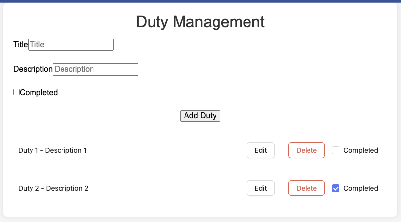

# To-Do List App

This is a simple To-Do List application built with a Node.js backend and a React frontend. The project is containerized using Docker.

## Prerequisites

- Docker
- Docker Compose

## Getting Started

### Clone the Repository

```bash
git clone https://github.com/micksyu/todo-list-app.git
cd todo-list-app
```

### Running the Application

1. **Start the Backend and Frontend using Docker Compose**

   ```bash
   docker-compose up --build
   ```

   This command will build and start the backend and frontend services. The backend will be running on port 3000, and the frontend will be running on port 3001.

2. **Access the Frontend**

   Open your browser and navigate to `http://localhost:3001`.

### Backend

The backend is a Node.js application using Express and PostgreSQL. It provides a RESTful API for managing to-do list items.

### Frontend

The frontend is a React application that interacts with the backend API to display and manage to-do list items.

## Project Structure

```
todo-list-app/
│
├── backend/
│   ├── src/
│   │   ├── controllers/
│   │   ├── models/
│   │   ├── routes/
│   │   ├── services/
│   │   └── index.ts
│   ├── tests/
│   ├── Dockerfile
│   └── package.json
│
├── frontend/
│   ├── src/
│   │   ├── components/
│   │   ├── api/
│   │   ├── types/
│   │   ├── App.tsx
│   │   ├── index.tsx
│   │   └── styles/
│   ├── tests/
│   ├── public/
│   ├── Dockerfile
│   ├── webpack.config.js
│   └── package.json
│
├── docker-compose.yml
└── README.md
```

## Running Tests

### Backend

To run tests for the backend, use the following commands:

```bash
cd backend
npm install
npm test
```

### Frontend

To run tests for the frontend, use the following commands:

```bash
cd frontend
npm install
npm test
```

## Screenshots

### Frontend

#### Home Page



#### Add Duty


#### Edit Duty


#### Delete Duty


## Contributing

Feel free to open issues or submit pull requests for any changes or improvements you would like to see.

## License

This project is licensed under the MIT License.
```
