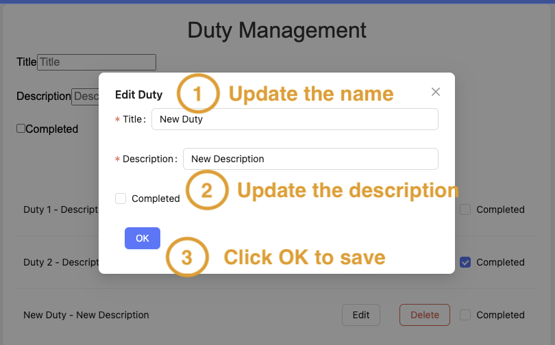

# To-Do List App

This is a simple To-Do List application built with a Node.js backend and a React frontend. The project is containerized using Docker.

## Prerequisites

- Docker
- Docker Compose

## Getting Started

### Clone the Repository

```bash
git clone https://github.com/micksyu/todo-list-app.git
cd todo-list-app
```

### Running the Application

### Backend Configuration

1. Create a `.env` file in the `backend` directory with the following content:
```
DB_HOST=postgres
DB_PORT=5432
DB_USER=your_database_user
DB_PASSWORD=your_database_password
DB_NAME=your_database_name
```

Replace `your_database_user`, `your_database_password`, and `your_database_name` with your actual database configuration details.

### PostgreSQL Configuration Using Docker

The `docker-compose.yml` file includes the following configuration for the PostgreSQL service:

```yaml
services:
  ...
  db:
    image: postgres:alpine3.20
    environment:
      POSTGRES_USER: postgres
      POSTGRES_PASSWORD: postgres
      POSTGRES_DB: dutiesdb
    ports:
      - "5432:5432"
    volumes:
      - postgres-data:/var/lib/postgresql/data
      - ./init.sql:/docker-entrypoint-initdb.d/init.sql
```

This configuration sets up the PostgreSQL service with the necessary environment variables and initializes the database using the `init.sql` script.

```sql
CREATE TABLE IF NOT EXISTS duties (
    id SERIAL PRIMARY KEY,
    title VARCHAR(255) NOT NULL,
    description TEXT NOT NULL,
    completed BOOLEAN NOT NULL DEFAULT FALSE
);

INSERT INTO duties (title, description, completed) VALUES
('Duty 1', 'Description 1', false),
('Duty 2', 'Description 2', true);
```


### Running the Application

#### Using Docker

1. Ensure Docker is installed and running on your machine.
2. Run the following command in the root directory:
```sh
docker-compose up --build
```

This will build and start the backend and frontend services, along with a PostgreSQL database on port 5432.
The backend will be running on port 3000, and the frontend will be running on port 3001.

3. **Access the Frontend**

   Open your browser and navigate to `http://localhost:3001`.

4. To stop and remove all running containers, networks, and volumes, run:
```sh
docker-compose down
```

#### Without Docker

1. Start the backend:
```sh
cd backend
npm run build
npm start
```

2. Start the frontend:
```sh
cd ../frontend
npm run build
npm start
```

### Backend

The backend is a Node.js application using Express and PostgreSQL. It provides a RESTful API for managing to-do list items.

### Frontend

The frontend is a React application that interacts with the backend API to display and manage to-do list items.

## Project Structure

```
│
├── backend/
│   ├── src/
│   │   ├── controllers/
│   │   ├── middlewares/
│   │   ├── models/
│   │   ├── routes/
│   │   ├── services/
│   │   ├── app.ts
│   │   ├── db.ts
│   │   └── server.ts
│   ├── package.json
│   ├── tsconfig.json
│   ├── .env
│   └── README.md
│
├── frontend/
│   ├── public/
│   │   ├── index.html
│   ├── src/
│   │   ├── api/
│   │   ├── components/
│   │   ├── styles/
│   │   ├── App.tsx
│   │   ├── index.tsx
│   │   └── types/
│   ├── tests/
│   │   ├── App.test.tsx
│   │   ├── DeleteModal.test.tsx
│   │   ├── DutyForm.test.tsx
│   │   └── DutyList.test.tsx
│   ├── package.json
│   ├── tsconfig.json
│   └── README.md
│
├── docker-compose.yml
└── README.md
```

## Running Tests

### Backend

To run tests for the backend, use the following commands:

```bash
cd backend
npm install
npm test
```

### Frontend

To run tests for the frontend, use the following commands:

```bash
cd frontend
npm install
npm test
```

## Screenshots

### Frontend

#### Home Page


#### Add Duty


#### Edit Duty




#### Delete Duty


## Contributing

Feel free to open issues or submit pull requests for any changes or improvements you would like to see.

## License

This project is licensed under the MIT License.
```
